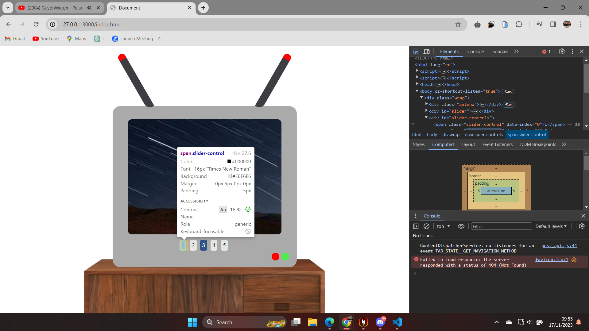

# Ramadhani-Prasetyo_4522210009_Prak_DW_A_Tgs9

# Penjelasan Html, Css, dan javascript :
## HTML
- <html>: Elemen akar dari dokumen HTML.
- <head>: Berisi metadata tentang dokumen, seperti judul dan link css.
- <body>: Berisi konten yang terlihat dari halaman web.
- 
: Elemen yang digunakan untuk mengelompokkan konten terkait.
- : Digunakan untuk menanamkan gambar ke dalam halaman web.
- <script>: Digunakan untuk menyertakan kode JavaScript.
